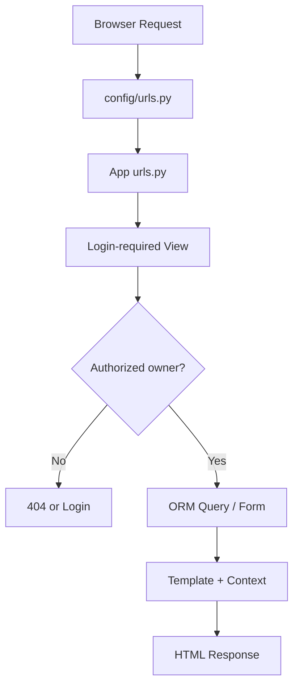
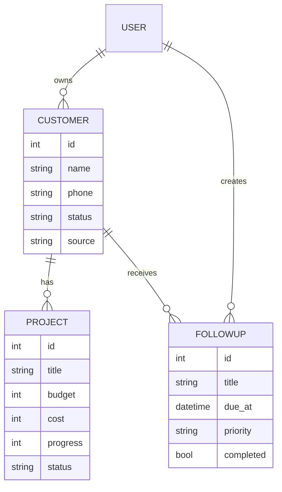

# معماری دیدبان CRM

## تصویر کلی

پروژه از الگوی استاندارد MTV در Django استفاده می‌کند:

- **Model:** ساختار و قواعد داده در `models.py`
- **Template:** HTML و نمایش در `templates/`
- **View:** دریافت Request، اجرای Query و انتخاب Response در `views.py`

جریان یک درخواست نمونه:



## رابطه موجودیت‌ها



## مسئولیت Appها

### `accounts`

- سفارشی‌کردن `AuthenticationForm`
- URLهای ورود و خروج
- Template صفحه Login

هیچ مدل User جدیدی ایجاد نشده و پروژه از User استاندارد Django استفاده می‌کند. این انتخاب برای مرحله فعلی ساده‌تر و کم‌ریسک‌تر است.

### `customers`

- مدل `Customer`
- مدل `FollowUp`
- فرم‌ها و اعتبارسنجی شماره تماس
- CRUD مشتری
- CRUD و Toggle پیگیری
- فهرست، فیلتر و CSV
- فرمان `seed_demo`

### `projects`

- مدل `Project`
- قواعد تاریخ و محاسبات مالی
- فرم محدودشده به مشتریان کاربر جاری
- CRUD، فیلتر و CSV

### `dashboard`

- Queryهای Aggregate برای KPI
- Pipeline مشتری و پروژه
- Template Tagهای `money` و `url_replace`
- Error Handlerهای 403 و 404

### `config`

- تنظیمات محیط و امنیت
- URLهای ریشه
- WSGI و ASGI

## مسیر URLها

| URL | نام Namespace | کارکرد |
|---|---|---|
| `/` | `dashboard:home` | داشبورد |
| `/accounts/login/` | `accounts:login` | ورود |
| `/accounts/logout/` | `accounts:logout` | خروج با POST |
| `/customers/` | `customers:list` | فهرست مشتریان |
| `/customers/new/` | `customers:create` | مشتری جدید |
| `/customers/<id>/` | `customers:detail` | پرونده مشتری |
| `/customers/followups/` | `customers:followup_list` | فهرست پیگیری‌ها |
| `/projects/` | `projects:list` | فهرست پروژه‌ها |
| `/projects/new/` | `projects:create` | پروژه جدید |
| `/admin/` | — | Django Admin |

## مکانیزم مالکیت و امنیت داده

قاعده اصلی این است: شناسه URL هیچ‌وقت به‌تنهایی برای واکشی رکورد کافی نیست.

نمونه امن:

```python
project = get_object_or_404(
    Project,
    pk=pk,
    customer__user=request.user,
)
```

اگر کاربر ID پروژه فرد دیگری را حدس بزند، پاسخ 404 دریافت می‌کند. بازگرداندن 404 به‌جای 403 در اینجا وجود آن رکورد را نیز افشا نمی‌کند.

در `ProjectForm` و `FollowUpForm` نیز گزینه‌های ForeignKey بر اساس User محدود شده‌اند. بنابراین کاربر حتی با POST دست‌کاری‌شده نمی‌تواند پروژه را برای مشتری فرد دیگری ثبت کند.

## محاسبات مالی

در سطح یک پروژه:

```text
profit = budget - cost
profit_margin = profit / budget × 100
```

در Dashboard، محاسبه کل با ORM و در دیتابیس انجام می‌شود:

```python
profit_expression = ExpressionWrapper(
    F("budget") - F("cost"),
    output_field=BigIntegerField(),
)
```

این روش از خواندن همه پروژه‌ها در حافظه Python جلوگیری می‌کند.

## تصمیم‌های طراحی مهم

### Function-Based View

برای یادگیری انتخاب شده است، چون مسیر Request تا Response را شفاف‌تر نشان می‌دهد. بعد از تسلط، می‌توانید CRUDها را به `ListView`, `CreateView`, `UpdateView` و `DeleteView` تبدیل کنید.

### SQLite در توسعه

برای اجرای فوری و بدون نصب سرویس جانبی مناسب است. برای تیم چندکاربره و بار نوشتن هم‌زمان، PostgreSQL توصیه می‌شود.

### CSS و JavaScript محلی

رابط به Bootstrap، Tailwind CDN یا Chart.js وابسته نیست. در نتیجه نسخه آفلاین هم ظاهر کامل دارد و سطح حمله Supply Chain کمتر است.

### حفاظت از تاریخچه پروژه

رابط `Project.customer` از `PROTECT` استفاده می‌کند. حذف مشتری تا زمانی که پروژه دارد ممکن نیست، چون سوابق مالی نباید ناخواسته از بین بروند.

## جریان ایجاد مشتری

1. URL به `customer_create` می‌رسد.
2. `@login_required` هویت را کنترل می‌کند.
3. `CustomerForm` داده را اعتبارسنجی می‌کند.
4. رقم‌های فارسی تلفن به انگلیسی تبدیل می‌شوند.
5. تکراری‌نبودن تلفن برای همان User بررسی می‌شود.
6. View مقدار `customer.user = request.user` را سمت سرور تنظیم می‌کند.
7. پس از Save، کاربر به Detail هدایت می‌شود.

مالک هرگز از POST مرورگر پذیرفته نمی‌شود؛ این یک اصل امنیتی مهم است.

## جریان Query فهرست

تابع `_filtered_customers` یک QuerySet زنجیره‌ای می‌سازد:

1. Scope مالک
2. Annotation تعداد پروژه
3. Search با `Q`
4. فیلتر Choiceهای معتبر
5. Ordering از Allowlist
6. Pagination در View

مرتب‌سازی مستقیماً از ورودی کاربر وارد `order_by()` نمی‌شود؛ فقط کلیدهای Allowlist پذیرفته می‌شوند.

